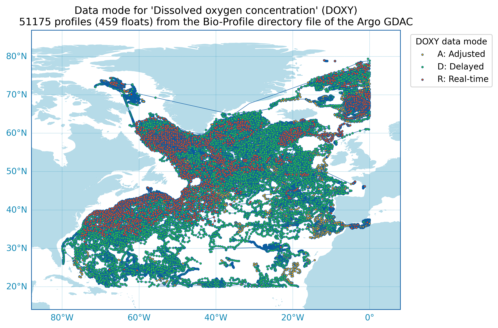
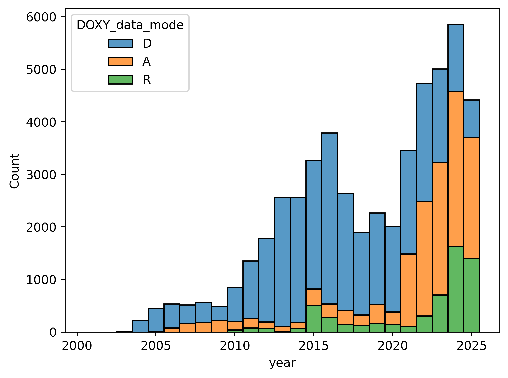
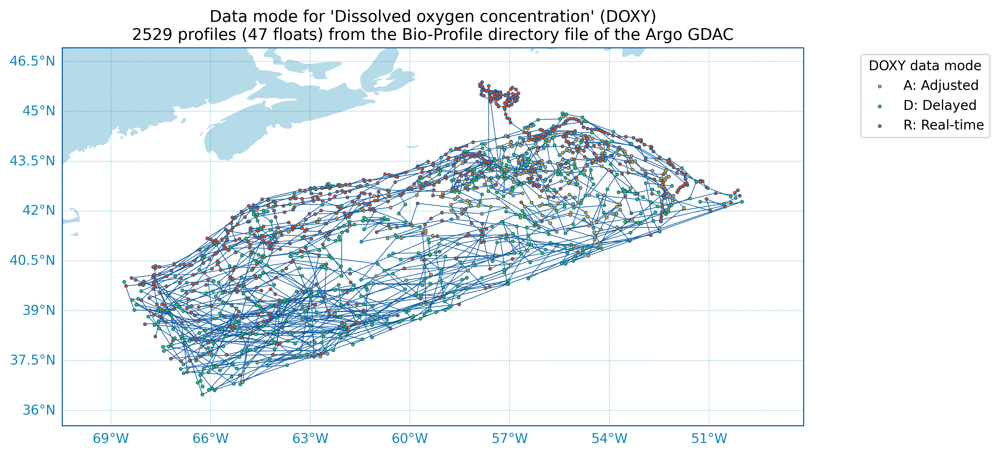
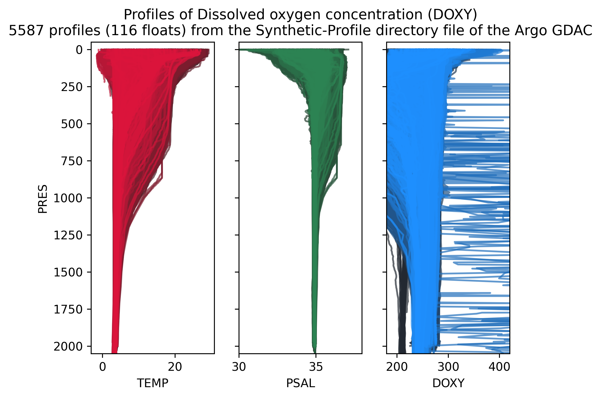

# North Atlantic Dissolved Oxygen Analysis

## Data Availability

The North Atlantic is a very well populated basin for Argo data and there are many dissolved oxygen data available.

Obviously these data lean modern, as the Argo program progressed and more BGC floats (and floats in general) were deployed.

## Early Analysis

A few areas of interest have been defined to make an initial analysis more manageable: the Scotian Shelf, Labrador Sea, and Baffin Bay to start. Looking at the Scotia Shelf:

Over the past 5 years there are x profiles from x floats:

Creating the following timeseries also over the last 5 years:

