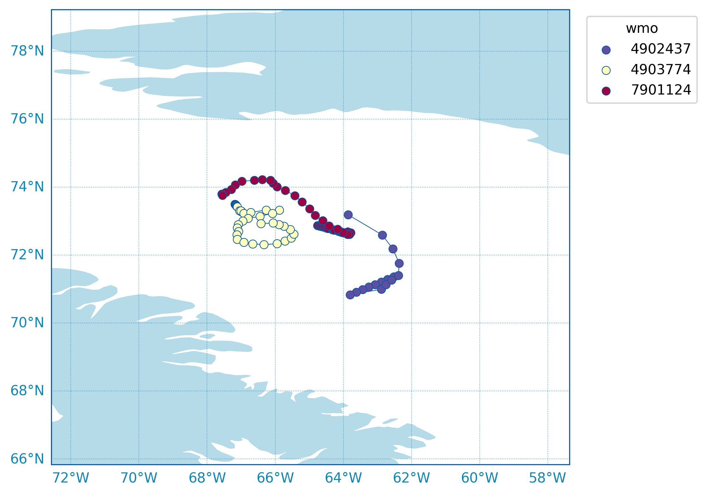
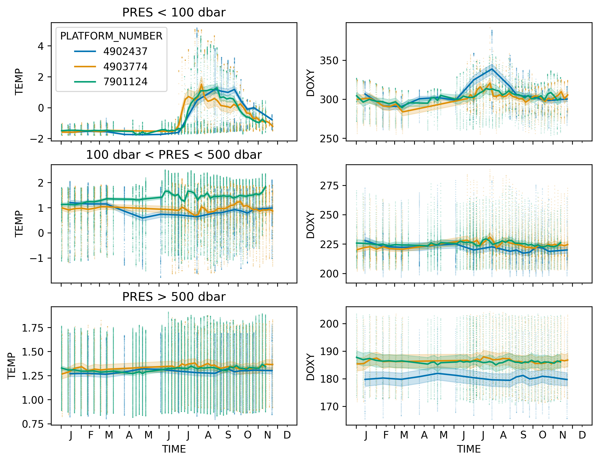
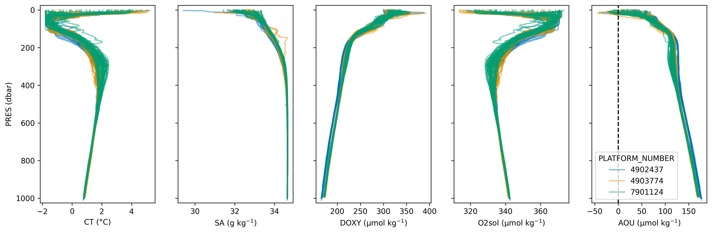

# Baffin Bay

Floats in central Baffin Bay in 2025:



Timeseries of temperature and oxygen:



Profiles including oxygen solubility and AOU:



Panels left to right: Conservative Temperature (CT, deg C), Absolute Salinity (g/kg), Dissolved Oxygen (DOXY, umol/kg), Oxygen Solubility (O2sol, umol/kg) and Apparent Oxygen Utilization (AOU, umol/kg)

AOU calculation:

```python
df['SA'] = gsw.SA_from_SP(df['PSAL'], df['PRES'], df['LONGITUDE'], df['LATITUDE'])
df['CT'] = gsw.CT_from_t(df['SA'], df['TEMP'], df['PRES'])
df['O2sol'] = gsw.O2sol(df['SA'], df['CT'], df['PRES'], df['LONGITUDE'], df['LATITUDE'])
df['AOU'] = df['O2sol'] - df['DOXY']
```